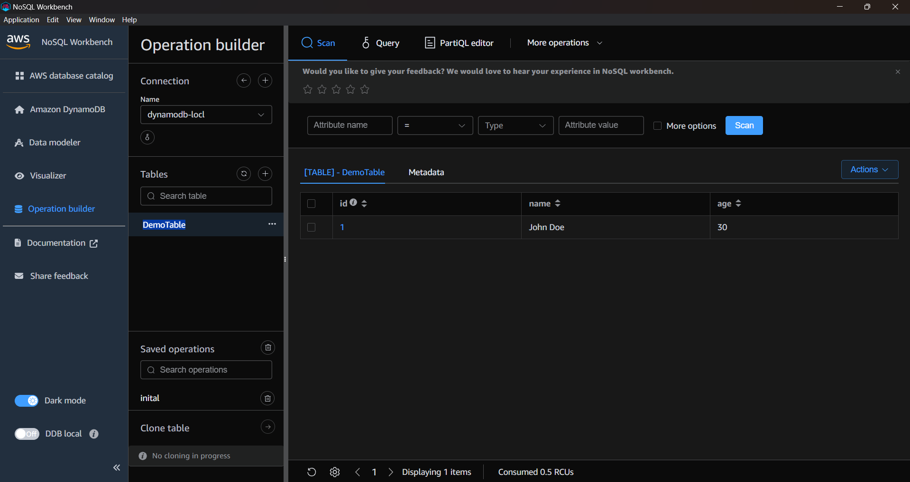

# Python - DynamoDB Local Operations
Automation of DynamoDB Local operations using Python and boto3

## Overview 🌐
DynamoDB Local Operations is a Python script designed to automate various operations on DynamoDB Local. 
This script utilizes the boto3 library to perform tasks such as creating tables, adding items, 
listing tables, and deleting tables. It provides a straightforward way to interact with a local 
instance of DynamoDB for testing and development purposes.

## Requirements 🛠️
- Python 3.12 or higher
- boto3
- Docker (for running DynamoDB Local)
- Poetry (for dependency management)


## Getting Started 🚀

1. Clone the DynamoDB Local Operations repository to your local machine.

```
https://github.com/daviidco/python-dynamodb.git
```

2. Start DynamoDB Local using Docker Compose:


```
docker-compose -f docker-compose.dynamo.yml up
```

3. Install project dependencies:
First, ensure you have Poetry installed. If not, follow the installation instructions from the Poetry website.
Then, install the project dependencies:

```
poetry install
```

If you don't have installed poetry:
https://python-poetry.org/docs/#installing-with-pipx


4. (Optional) Install NoSQL Workbench:
For a visual tool to design, visualize, and query DynamoDB databases, you can install NoSQL Workbench.

https://docs.aws.amazon.com/amazondynamodb/latest/developerguide/workbench.settingup.html


## Usage 💡
The script provides several functions to interact with DynamoDB Local:

- create_table(): Creates a table in DynamoDB Local with a simple schema.
- list_tables(): Lists all tables in DynamoDB Local.
- add_item(): Adds an item to the specified table.
- delete_table(table_name: str): Deletes the specified table from DynamoDB Local.

To use the script, open `main.py` and uncomment or modify the function calls at the bottom of the file as needed. Then run:

```
python main.py
```


## Features 🌟
- Create Table: Initializes a new table with a specified schema.
- List Tables: Displays all existing tables in the local DynamoDB instance.
- Add Item: Inserts an item into a specific table.
- Delete Table: Removes a table from the local DynamoDB instance.

## Screenshots 📸


## Contributing 🤝
Contributions are welcome. Please follow the contribution guidelines.

## License 📄
DynamoDB Local Operations is licensed under the MIT License. See the LICENSE file for more details.

